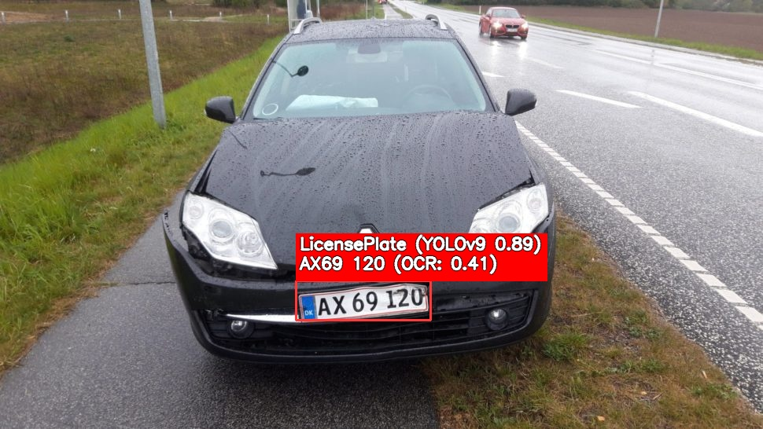

<h3 align="center">This project is meant for <a href="https://github.com/Arguimbau">@Arguimbau</a> and <a href="https://github.com/Kai0077">@Kai0077</a>'s elective exam in Machine-Learning</h3>
<h2>The goal for this project is to use YOLOv9 to detect wether or not a licence plate is in a picture, and then use EasyOCR to detect the text within
</h2>
<h2> Example of the project in action<br>  </h2>
<h2>How to use the project</h2>
<h3>Depending on if you are on Windows/Mac or use CUDA, you need to setup your project like so
<br>
<br>
In this line 
```bash
!python detect.py --weights weights/best.pt --source {image} --device cpu --save-txt --save-crop
```
Change the --device to:
<br><br>
<ul>
<li>Windows(No CUDA)/Mac(not silicon): cpu</li>
<li>Mac(silicon): mps</li>
<li>Windows(CUDA): 0</li>
</ul>
<h1>The weight is too large for GitHub, so I recommend training the dataset yourself to get it
</h1>
The dataset can be found here:
https://universe.roboflow.com/mashinelearning/licence-plate-detection-wcfzj
<br>

